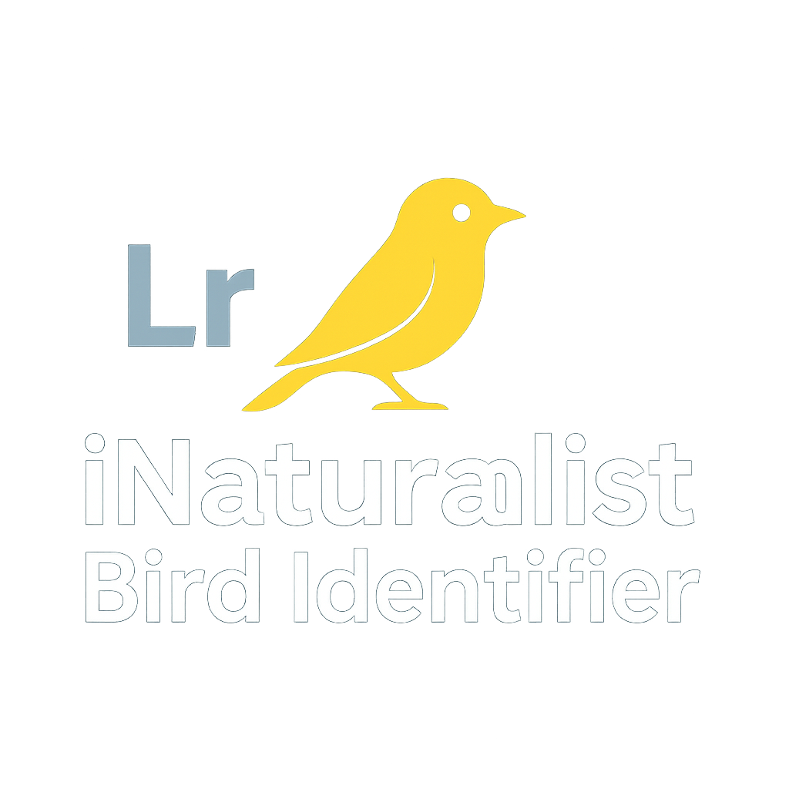

# iNaturalist Identifier

*A Lightroom Classic plugin that identifies species in photos using the iNaturalist API.*

---

> ⚠️ **Disclaimer**  
> Use of this plugin is **at your own risk**.  
> The author and contributors cannot be held responsible for any data loss, catalog corruption, or damage to your images in Lightroom.  
> 
> **Before using the plugin:**
> - Make a **full backup of your Lightroom catalog**.  
> - Ensure your **original images are safely backed up**.  
> - Test the plugin on a **copy of your catalog or images** first.  
> 
> By using this plugin, you acknowledge and accept these precautions.  

---

## 📌 Table of Contents

- [Overview](#-overview)
- [Features](#-features)
- [Installation](#-installation)
- [Configuration](#-configuration)
- [Usage](#-usage)
- [Plugin Structure](#-plugin-structure)
- [Dependencies](#-dependencies)
- [Development](#-development)
- [License](#-license)
- [Support the Project](#-support-the-project)

---

## 🐾 Overview

The iNaturalist Identifier plugin integrates with Adobe Lightroom Classic to help photographers automatically identify species in their photos. It uses the iNaturalist API to analyze selected images and adds identification tags based on the results.

---

## ✨ Features

- 📤 Send photos to iNaturalist’s image recognition API
- 🏷️ Automatically tag photos with identified species
- 📚 Batch tagging support (coming soon)
- 🔍 View detailed API responses for each image
- 🧩 Lightweight and simple plugin written in Lua

---

## ⚙️ Installation

1. [📥 Download the latest release](https://github.com/pbranly/Inaturalist-Identifier-Lightroom/releases/latest)
2. Open Lightroom Classic
3. Go to **File > Plugin Manager**
4. Click **Add** and select the plugin folder
5. Confirm installation

---

## 🔐 Configuration

The plugin requires an iNaturalist API token:

- Create an account on [iNaturalist](https://www.inaturalist.org)
- Generate a personal access token from your profile settings
- Enter the token in the plugin panel in Lightroom

> ⚠️ **Note:** Tokens are valid for 24 hours only.

---

## 🖼️ Usage

- Select one or more photos in the Lightroom Library (*batch mode not fully tested*)
- Use the plugin menu to send them to the iNaturalist API
- Review and apply species tags based on the results

---

## 📁 Plugin Structure

| File | Description |
|------|-------------|
| `Info.lua` | Plugin metadata and entry point |
| `AnimalIdentifier.lua` | Handles image upload and API calls |
| `call_inaturalist.lua` | Sends requests and processes responses |
| `SelectAndTagResults.lua` | UI for selecting and tagging species |
| `json.lua` | JSON utility functions |

---

## 🧩 Dependencies

- Adobe Lightroom Classic (Lua plugin support)
- Internet connection
- Lua standard libraries (bundled with Lightroom)

---

## 🛠️ Development

Want to contribute? Great!

1. Fork the repository
2. Make your changes
3. Submit a pull request

---

## 📄 License

This project is licensed under the MIT License. See the LICENSE file.  
Developed by Philippe Branly.

---

## ☕ Support the Project

If this plugin is useful to you, consider supporting its development:

- [Buy me a coffee](https://www.buymeacoffee.com/philippebro)
- [Donate via PayPal](https://www.paypal.me/philippebranly)
